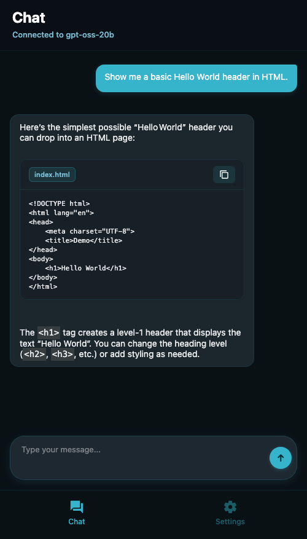
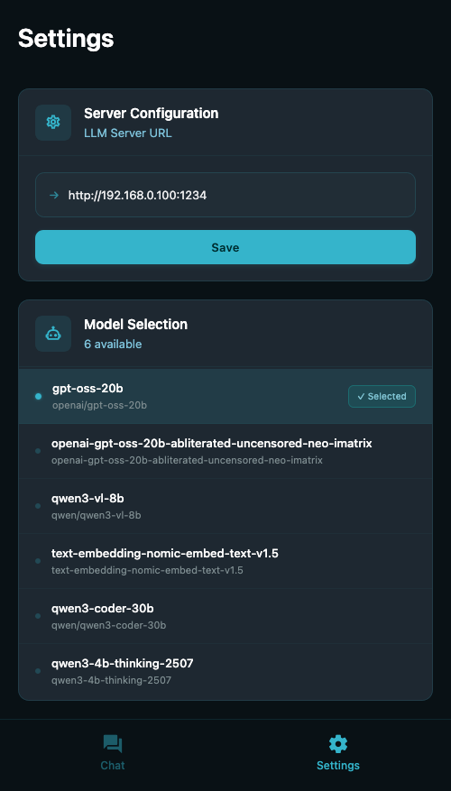

# PocketLM


PocketLM is a lightweight, cross-platform client (mobile + web) for interacting with locally hosted or self‑managed LLM services. It auto-discovers models exposed by LM Studio–compatible servers, lets you start conversational sessions with a selected model, and renders responses with rich Markdown (including tables and fenced code blocks with copy). Server and model selections are persisted for repeatable workflows, and the app runs against your own infrastructure for low latency and better privacy. an approachable, powerful interface for both casual users and technical users who manage their own models.

**Features**

- 🚀 Fast local LLM client
	- Connect to self-hosted or local LLMs for rapid iteration.

- 💬 Polished chat UI
	- Message bubbles, typing indicator, and smooth messaging UX.

- 📝 Lightweight Markdown support
	- Renders headings, bold, italic, inline code, lists, and tables inside chat messages.

- 🧾 Code blocks + copy
	- Fenced blocks show language labels, selectable code, and a copy button (native/web).

- 🔎 Model & server tools
	- Auto-discovers models on the configured LM Studio-compatible server; unload models and run connectivity checks.

- 🌐 Dev proxy & config
	- Local Express proxy avoids CORS; server URL and selected model persist in `localStorage`.


**Screenshots**:




**Key ideas:** mobile + web client built with Expo, TypeScript, and React; uses a small local proxy for web to avoid CORS when talking to an LM server.

**Repository layout (high level)**
- `app/` — Expo app source (file-based routing)
- `components/`, `lib/`, `assets/` — UI and helper code
- `scripts/` — local dev helpers (proxy, reset-project)
- `src/` — additional library code used for web/dev utilities

Stack
- Expo (React Native) + `expo-router`
- React, TypeScript
- Simple Express proxy for web development (`scripts/proxy.js`)

Getting started (development)

Prerequisites
- Node.js (v16 or newer recommended)
- npm (or yarn)
- Xcode / Android Studio if you plan to run simulators

Install dependencies

```bash
npm install
```

Run the local proxy (recommended for web development)

```bash
npm run proxy:start
# Proxy listens on http://localhost:5173 and forwards /v1 -> the configured LM server
```

Start the Expo dev server

```bash
npm start
# or platform-specific
npm run ios
npm run android
npm run web
```

Useful scripts
- `npm start` — runs `expo start`
- `npm run ios` / `npm run android` / `npm run web` — platform shortcuts
- `npm run proxy:start` — starts the local Express proxy (`scripts/proxy.js`)
- `npm run reset-project` — moves starter code to `app-example` and creates a blank `app` directory
- `npm run lint` — runs Expo linting

Configuration & notes
- By default the app points to a remote IP LM server. The runtime server URL is managed in `src/lib/config.ts` (and `app/lib/llmApi.ts` defines a different base for web vs native). For web development the app uses the local proxy at `http://localhost:5173` which forwards `/v1` to the configured LM server.
- To change the default LM server URL, edit `src/lib/config.ts` or set it at runtime in the web app (the code stores server URL and selected model in `localStorage` for web).
- The proxy is intentionally permissive (CORS allowed) for developer convenience. Don't use it as-is in production.

Development tips
- If the web app can't reach the LM server, verify the proxy is running and check the proxy console logs.
- Use the `testConnectivity` and `listModels` helpers in `src/lib/llmApi.ts` to debug server reachability and available models.

Contributing
- Open an issue or send a PR. Keep changes focused and add tests when appropriate.
